# 🐳 DockerHub部署快速指南

## 🚀 快速开始

### 1. 前置准备

**在DockerHub上创建仓库：**
- 登录 [DockerHub](https://hub.docker.com/)
- 创建仓库：`saascontrol-frontend` 和 `saascontrol-backend`

**本地环境要求：**
- Docker 和 Docker Compose
- Git（用于代码管理）

### 2. 设置GitHub自动构建

**配置GitHub Secrets：**
```bash
# 在GitHub仓库中添加以下Secrets：
DOCKERHUB_USERNAME=你的DockerHub用户名
DOCKERHUB_TOKEN=你的DockerHub访问令牌
```

**触发自动构建：**
```bash
# 推送到main分支触发latest标签构建
git push origin main

# 创建版本标签触发版本构建
git tag v1.0.0
git push origin v1.0.0
```

### 3. 一键部署到云服务器

**步骤1：上传部署文件**
```bash
# 只需上传这些文件到云服务器：
scp docker-compose.dockerhub.yml user@your-server:/opt/saascontrol/
scp deploy-from-dockerhub.sh user@your-server:/opt/saascontrol/
scp .env.dockerhub.example user@your-server:/opt/saascontrol/
```

**步骤2：配置环境变量**
```bash
# 在云服务器上
cd /opt/saascontrol
cp .env.dockerhub.example .env.dockerhub
nano .env.dockerhub  # 编辑配置文件
```

**步骤3：一键部署**
```bash
# 替换为您的DockerHub用户名
./deploy-from-dockerhub.sh -u your_dockerhub_username
```

## 📋 部署流程详解

### 自动化CI/CD流程

```mermaid
graph LR
    A[代码推送] --> B[GitHub Actions]
    B --> C[构建镜像]
    C --> D[安全扫描]
    D --> E[推送到DockerHub]
    E --> F[部署通知]
```



**触发条件：**
- `main`分支推送 → `latest`标签
- `develop`分支推送 → `dev`标签
- Git标签推送 → 对应版本标签

### 镜像构建策略

**多架构支持：**
- `linux/amd64` - Intel/AMD服务器
- `linux/arm64` - ARM服务器（如AWS Graviton）

**镜像优化：**
- 多阶段构建减小镜像体积
- 安全扫描确保镜像安全
- 层缓存提高构建速度

## 🔧 高级使用

### 环境特定部署

```bash
# 开发环境
./deploy-from-dockerhub.sh -u username -t dev -e .env.dev

# 测试环境
./deploy-from-dockerhub.sh -u username -t staging -e .env.staging

# 生产环境
./deploy-from-dockerhub.sh -u username -t v1.2.3 -e .env.production
```

### 服务管理命令

```bash
# 查看服务状态
docker-compose -f docker-compose.dockerhub.yml ps

# 查看服务日志
docker-compose -f docker-compose.dockerhub.yml logs -f

# 重启特定服务
docker-compose -f docker-compose.dockerhub.yml restart frontend-app

# 更新到新版本
./deploy-from-dockerhub.sh -u username -t v1.2.4
```

### 健康检查

```bash
# 前端健康检查
curl -f http://localhost:9000/api/health

# 后端健康检查
curl -f http://localhost:8000/health
curl -f http://localhost:8100/health

# 完整服务验证
./scripts/verify-deployment.sh
```

## 🛡️ 安全最佳实践

### 环境变量安全

```bash
# 使用强密码
SECRET_KEY=$(openssl rand -base64 32)

# 保护环境文件
chmod 600 .env.dockerhub

# 定期轮换密钥
# 更新API密钥和数据库密码
```

### 镜像安全

- ✅ 自动漏洞扫描（Trivy）
- ✅ 非root用户运行
- ✅ 最小化基础镜像
- ✅ 定期更新依赖

## 📊 监控和日志

### 服务访问地址

| 服务 | 地址 | 用途 |
|------|------|------|
| 前端应用 | http://localhost:9000 | 主应用界面 |
| API文档Pro1 | http://localhost:8000/docs | API文档 |
| API文档Pro2 | http://localhost:8100/docs | API文档 |
| MinIO控制台 | http://localhost:9002 | 对象存储管理 |

### 日志查看

```bash
# 实时日志
docker-compose -f docker-compose.dockerhub.yml logs -f

# 特定服务日志
docker-compose -f docker-compose.dockerhub.yml logs frontend-app
docker-compose -f docker-compose.dockerhub.yml logs backend-pro1

# 错误日志过滤
docker-compose -f docker-compose.dockerhub.yml logs | grep ERROR
```

## 🔄 更新和回滚

### 零停机更新

```bash
# 拉取新镜像
docker-compose -f docker-compose.dockerhub.yml pull

# 滚动更新
docker-compose -f docker-compose.dockerhub.yml up -d --no-deps frontend-app
```

### 快速回滚

```bash
# 回滚到指定版本
./deploy-from-dockerhub.sh -u username -t v1.1.0

# 回滚到latest
./deploy-from-dockerhub.sh -u username -t latest
```

## 🆘 故障排除

### 常见问题

**镜像拉取失败：**
```bash
# 检查镜像是否存在
docker pull username/saascontrol-frontend:latest

# 检查DockerHub登录
docker login
```

**服务启动失败：**
```bash
# 查看详细错误
docker-compose -f docker-compose.dockerhub.yml logs service-name

# 检查端口占用
netstat -tulpn | grep 9000
```

**数据库连接失败：**
```bash
# 测试数据库连接
PGPASSWORD="password" psql -h host -p 5432 -U user -d database -c "SELECT version();"

# 检查网络连通性
telnet 47.79.87.199 5432
```

### 支持资源

- **项目文档：** `docs/` 目录
- **错误日志：** Docker容器日志
- **健康检查：** `/health` 端点
- **API文档：** `/docs` 端点

---

## 📝 总结

使用DockerHub的优势：
✅ **简化部署** - 无需在生产服务器构建
✅ **版本管理** - 清晰的镜像版本控制
✅ **快速回滚** - 一键切换到任意版本
✅ **多环境支持** - 统一的部署流程
✅ **安全可靠** - 自动安全扫描和验证

这种方式特别适合生产环境，提供了企业级的部署和管理体验。